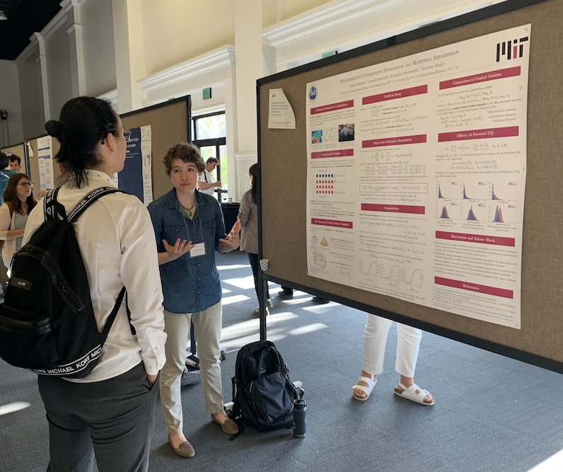
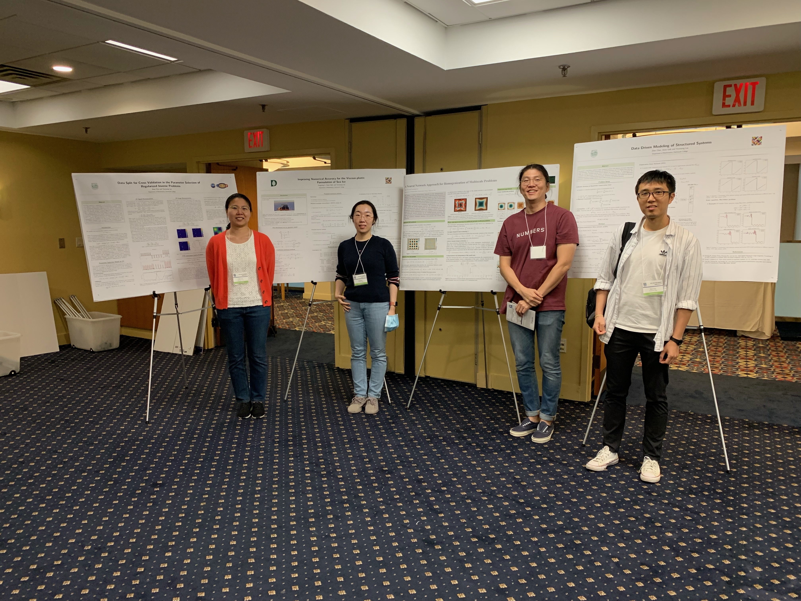
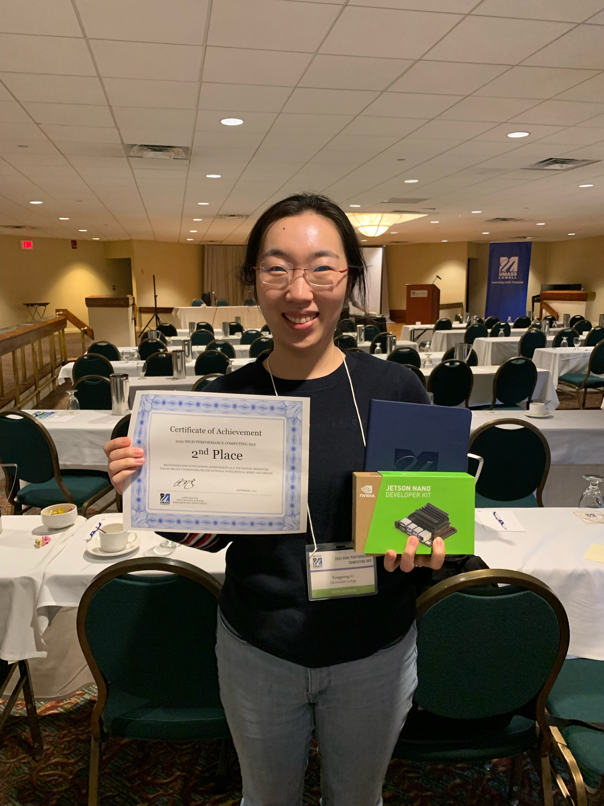

* (Sep 28, 2022) MIT PhD student, Aimee Maurais, presented a poster at SIAM MDS 2022 held at San Diego CA.

* (Sep 9, 2022) Dartmouth postdocs, Bosu Choi, Tongtong Li, Jihun Han, and Zhen Chen, presented posters at [HPC day 2022](https://www.uml.edu/conferences/hpc-2022/) held at UMass Lowell.
Congrats Tongtong for the 2nd place award.

<iframe src="https://calendar.google.com/calendar/embed?height=600&amp;wkst=1&amp;bgcolor=%23ffffff&amp;ctz=America%2FNew_York&amp;src=Y19oc2o3dWo4aXU4bHNjMHQ2ZWw2Z3FzM2ZyOEBncm91cC5jYWxlbmRhci5nb29nbGUuY29t&amp;color=%237CB342" style="border:solid 1px #777" width="800" height="600" frameborder="0" scrolling="no"></iframe>
